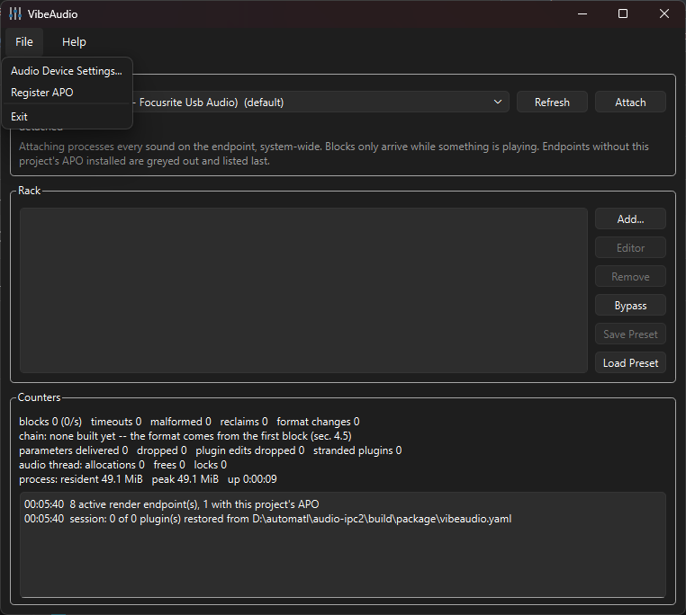
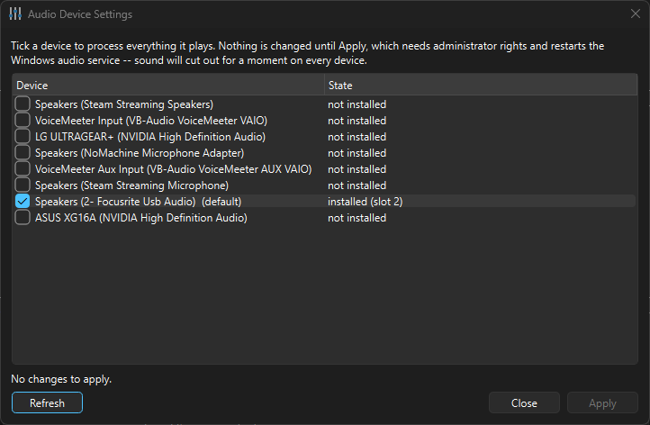
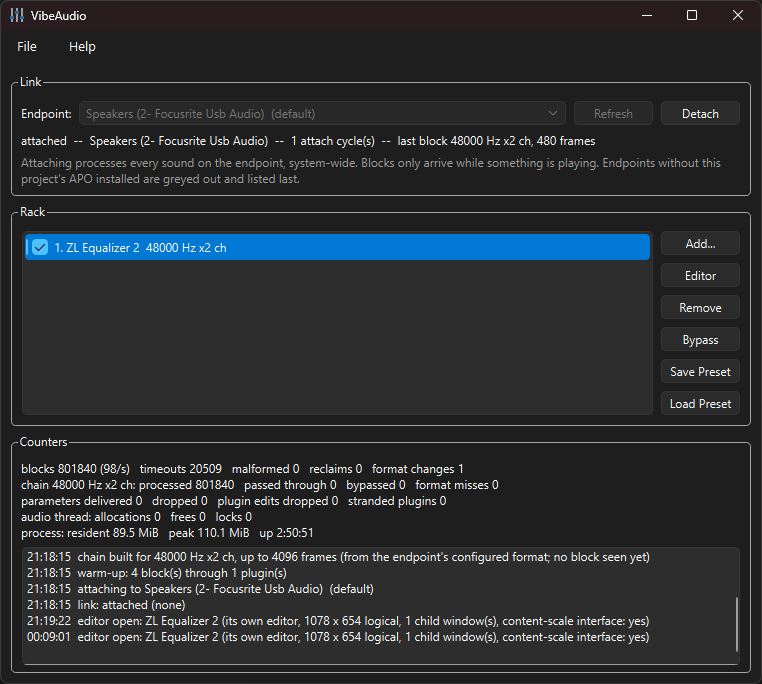
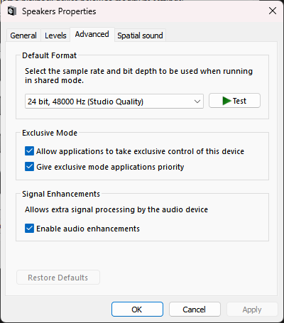
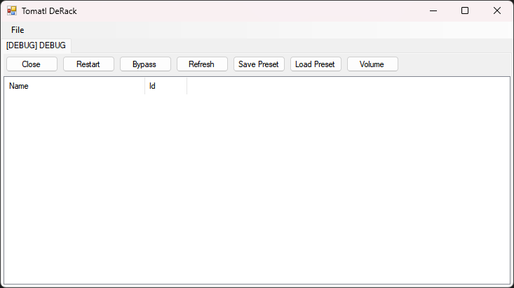

# VibeAudio

A system-wide VST3 host for Windows. Allows you to process sound coming from any process to a particular audio device.

## How to use

1. Download latest binary [release](https://github.com/kykc/audio-vibe/releases) or [build it yourself](DEVELOPER.md)
2. Unzip downloaded archive to the desired location
3. Run `vibeaudio.exe`

4. `Register APO` from the `File` menu (needed only once)

5. Go to `Audio Device Settings`
6. Select device(s) you want to use with VibeAudio
7. `Apply` the changes. CAUTION: this will restart `Windows Audio Service` (`audiodg.exe`)

8. Select desired audio device from the list and click `Attach`
9. Add desired plugin(s) to the processing chain (plugin list should be autodiscovered from the idiomatic VST3 location just like you'd expect for any other VST3 host)
10. Modify plugin settings as desired
11. Enjoy!

NOTE: currently, by enabling VibeAudio you will lose all built-in audio "enhancements" shipped with your device. I find them useless in 99% of cases anyway.

## Troubleshooting

Wiring into an arbitrary audio device can be somewhat messy, so here I will collect a list of known gotchas:

1. Make sure you have [MSVC++ Redistributable](https://aka.ms/vc14/vc_redist.x64.exe) installed
2. Make sure audio enhancements are enabled on your device (accessible only in the "old" control panel AFAIK)
   

## History

This project has a surprisingly long history: originally I started this about 15 years ago. At the time I was
searching for a solution to apply system-wide linear audio compensation (aka Parametric EQ) on Windows (Windows 7 at the time). I stumbled upon the `Equalizer APO` project (see honorable mentions below) when searching for a solution. At the time this project was completely GUI-less, parametric EQ settings were authored as a plain text file and you had to restart `audiodg` each time you changed those settings. But it worked!

I imagined: how cool it would be to have a primitive VST host (VST2 at the time) which would allow me to load
arbitrary VST plugins and apply them system-wide in real-time! I spent a lot of time bashing my head against
this idea, learning many useful and useless things along the way:

* Internals of WASAPI and APO
* Windows kernel's scheduler (since Vista IIRC) has two orthogonal priority systems: one for throughput (classic priorities you see in Task Manager), one for latency (AVRT thread priorities/groups)
* Lock-free sync primitives and data structures to exchange data between UI and real-time threads.
* Real-time thread hygiene: no heap allocations, no syscalls, etc.
* C to dotnet interop via `DllImport`
* C++ to dotnet interop via C++/CLI (man, that was something)

In the end I was able to make it work, and then continuously used it for the last 15 years or so. Here's the screenshot of this thing, for posterity:

However, I never released it, partly due to the lack of time to create a proper installer/streamlined APO registration, settings management and so on, partly due to being stupidly shy at the time.

As I did not want to use something like MFC for the GUI part, the tech stack that I chose in the end was rather peculiar:

* MSVC 2008 C++ "engine" with IPC client and VST2 host implementation, which thankfully was C (in contrast with C++-only VST3)
* C#/.NET 2.0 Windows Forms GUI
* C++/CLI as glue in the middle

Now, many years later, this became a burden to support this thing even for myself. And I had another brilliant idea: what if I feed an LLM my old code, make a thorough design doc with all the "important knowledge" I gathered when originally doing this, and let the LLM write the code, saving me the time? The result of this experiment is right before your eyes. Not a single line of code was written by me directly here.

There was another part of this project which I abandoned completely: a self-written parametric EQ. At the time I could not find a free/FOSS solution, so I wrote one myself. However, these days there is the wonderful ZL Equalizer 2, which is free, FOSS and does its job perfectly well (see honorable mentions).

Apart from me, there was another constant user of this "product" all these years: my father. He was an avid music lover and needed compensation for the headphones just like me, and later on also for his declining hearing as he became older. He often said to me: "Why don't you release DeRack publicly? Other people might find it very useful as well". Sadly, my father died last year, before I found time/courage to release this, but I did not forget his words. So, I'm dedicating this to you, Father.

## Author's design goals

* Entropy level as low as possible: one language, minimal dependencies, minimal (but still usable) UI,
  minimal bundle size, no "web tech" (more harm than good as native UI is inevitable due to VST3 internals)
* Native/modern look with HiDPI support and light/dark theming
* Rock-solid performance: supposed to be able to run for days and days without any interruptions and/or crashes and/or audible glitches
* Zero added latency. Despite all the processing and IPC involved, everything should be fast enough to always fit into the 10 ms
  timeframe defined by WASAPI

NOTE: as this is a strictly real-time processing scenario, there is no way to compensate for the latency introduced by the loaded
plugin, if it uses look-ahead, linear-phase filtering or any other DSP technique that results in additional [latency](https://steinbergmedia.github.io/vst3_doc/vstinterfaces/classSteinberg_1_1Vst_1_1IAudioProcessor.html#af8884671ccefe68e0a86e72413a0fcf8).

## Developer guide

Is available as a separate [document](DEVELOPER.md), as it is rather long.

## Third-party dependencies and honorable mentions

* [Qt6](https://www.qt.io/development/qt-framework/qt6) - LGPLv3, linked dynamically
* [yaml-cpp](https://github.com/jbeder/yaml-cpp) - MIT
* [Mixing table icons created by Magnific - Flaticon](https://www.flaticon.com/free-icons/mixing-table)
* [VST3 - property of Steinberg](https://github.com/steinbergmedia/vst3sdk) - MIT
* [Equalizer APO](https://sourceforge.net/projects/equalizerapo/) - honorable mention, used as an inspiration 15 years ago
* [ZL Equalizer 2](https://github.com/ZL-Audio/ZLEqualizer) - honorable mention, if you think that spending money on a parametric EQ is ridiculous in 2026 - grab this one

## Liability waiver

This software is provided "as is", without warranty of any kind. Use it at
your own risk. The authors accept no responsibility for any damage, data
loss, or other consequences resulting from its use. See the LICENSE file
for full terms.
